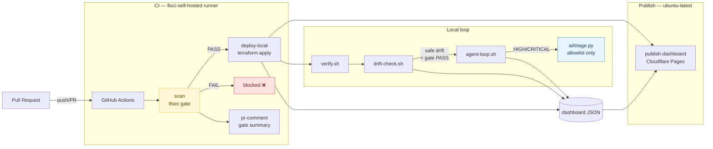
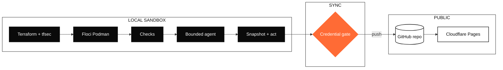
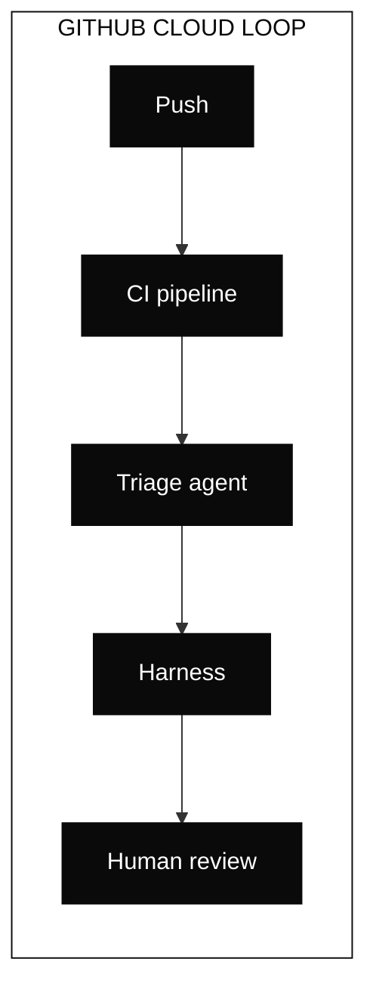

# CONTEXT.md — Architecture & Security Rationale

This document is the deep-dive companion to [README.md](README.md). README is the
quick start; this is *why the sandbox is built the way it is*. See also
[SKILL.md](SKILL.md) (operating rules for AI agents in this repo) and
[CHANGELOG.md](CHANGELOG.md).

## Contents

- [Architecture](#architecture)
- [Why floci specifically](#why-floci-specifically)
- [What "deliberate misconfig" means](#what-deliberate-misconfig-means)
- [Offline-first design](#offline-first-design)
- [Backend never exposed — the data-plane table](#backend-never-exposed--the-data-plane-table)
- [Known floci limitation](#known-floci-limitation)
- [Security decisions in code](#security-decisions-in-code)

## Architecture

Four diagrams, each a different zoom level on the same loop. Sources live in
`docs/diagrams/*.mmd`; `scripts/render-mermaid.sh` can render them to SVG for
non-Mermaid viewers, but GitHub renders the blocks below natively.

### Pipeline overview

### Local sandbox loop

### GitHub cloud loop

### Developer dataflow

```mermaid
flowchart LR
    subgraph S1["① ② GATE & APPLY"]
        direction TB
        SCAN["scan.sh"]
        GATE{"GATE"}
        APPLY["deploy.sh"]
        SCAN --> GATE -->|"PASS"| APPLY
    end

    subgraph S2["③ VERIFY"]
        direction TB
        V1["verify.sh"]
    end

    subgraph S3["④ DRIFT"]
        direction TB
        D1["drift-check.sh"]
    end

    subgraph S4["⑤ ⑥ RESPOND"]
        direction TB
        AG["agent-loop.sh"]
        J[("JSON")]
        DEV["pages dev"]
        DEP["pages deploy"]
        AG --> J
        J --> DEV
        J --> DEP
    end

    APPLY --> V1 --> D1 -->|"drift"| AG

    %% 2026 modern aesthetic: black-and-white shape language with one
    %% warm amber accent reserved for the security choke-point (GATE).
    %% Cluster backgrounds: white with a thin black border; the post-
    %% process CSS injects a soft drop shadow and rounded corners so
    %% each cluster reads as a frosted card lifted off the canvas.
    classDef section fill:#ffffff,stroke:#0a0a0a,color:#0a0a0a,stroke-width:1px
    classDef black fill:#0a0a0a,stroke:#0a0a0a,color:#ffffff,stroke-width:2px
    classDef white fill:#ffffff,stroke:#0a0a0a,color:#0a0a0a,stroke-width:1.5px
    classDef gray fill:#fafafa,stroke:#0a0a0a,color:#0a0a0a,stroke-width:1.5px
    classDef diamond fill:#ff6b35,stroke:#ff6b35,color:#ffffff,stroke-width:2px
    classDef store fill:#ffffff,stroke:#0a0a0a,color:#0a0a0a,stroke-width:1.5px

    class S1,S2,S3,S4 section
    class SCAN,APPLY black
    class V1,D1 white
    class AG,DEV,DEP gray
    class GATE diamond
    class J store
```

## Why floci specifically

"floci" is this sandbox's own name for a single-container AWS stub, not a
product. Under the hood it is
[`docker.io/motoserver/moto`](https://github.com/getmoto/moto) (Apache-2.0,
no auth) run via `podman-compose.yml`:

- **One container, one port.** `floci-core` binds `0.0.0.0:4566`, `MOTO_ACCOUNT_ID`
  fixed to `000000000000`. Every one of the 7 Terraform modules points its AWS
  provider at this single endpoint via `TF_<SERVICE>_ENDPOINT` env vars.
- **`network_mode: host`, not bridge.** WSL2's netavark backend cannot apply
  the nftables rules Podman's default bridge network needs (missing kernel
  capability on this host) — host mode sidesteps it entirely.
- **The dummy account ID is load-bearing, not cosmetic.** `sync-dashboard.sh`'s
  credential gate explicitly allowlists ARNs under `000000000000` and blocks
  everything else — the account ID is how the gate tells "floci output" apart
  from "something that looks like real AWS."
- **The Terraform variable is still called `localstack_endpoint`.** That's a
  naming holdover, not a hint that LocalStack is involved — moto is what's
  actually running.
- **It's explicitly a stub, not a full emulator** — see
  [Known floci limitation](#known-floci-limitation). The tradeoff is deliberate:
  a shift-left CI demo needs something fast, free, and reachable with zero
  setup, not full API fidelity.
- **CI and local dev now run two different Podman versions.** `deploy-local`
  installs whatever Ubuntu 24.04's apt repo ships (currently Podman 4.9.x)
  fresh on every `ubuntu-latest` run; local WSL2 development is documented
  and validated against Podman 5.x (see SKILL.md). Nothing in `scripts/`
  hard-checks Podman's version the way `scan.sh` hard-checks tfsec's, so
  this skew is a known, accepted gap rather than a gate failure.

## What "deliberate misconfig" means

One resource, `aws_iam_policy.fixtures_admin` in
`terraform/modules/security/main.tf`, is intentionally written with
`Action:"*"` / `Resource:"*"` — a HIGH finding (`AVD-AWS-0057`) that tfsec is
guaranteed to catch. It exists to give the pipeline something real to gate on.

- **Toggled by file swap, not by editing HCL.** `scripts/toggle-fixture.sh`
  copies between three committed files — `main.tf`, `main.tf.with-fixture`,
  `main.tf.without-fixture` — and runs `terraform validate` before the swap is
  made permanent. No sed/regex on HCL; `cp` is deterministic and reversible.
- **Hard-blocked from auto-remediation everywhere.** `scripts/ai/triage.py`
  keeps `AVD-AWS-0057` in a `FIXTURE_RULES` frozenset it will never touch;
  `scripts/agent-loop.sh` doesn't edit `*.tf` at all. This is enforced in two
  independent places on purpose.
- **Requires human review.** `.github/CODEOWNERS` pins
  `/terraform/modules/security/` to a named reviewer — the fixture can't be
  changed by an unreviewed PR, including one opened by the `floci-agent-loop`
  bot.
- **Demonstrates both pipeline states.** With the fixture `on`, `scan.sh` fails
  and blocks `deploy.sh`. With it `off`, the gate passes and the rest of the
  demo (`deploy.sh` → `verify.sh` → `drift-check.sh` → `agent-loop.sh`) runs
  end to end.

## Offline-first design

Nothing in this sandbox calls real AWS, and that's enforced at more than one
layer rather than assumed:

- **Every module's provider endpoint is overridden** to floci
  (`TF_S3_ENDPOINT`, `TF_EC2_ENDPOINT`, … one per AWS service used across the
  7 modules) — there's no code path where a module falls back to a default
  AWS endpoint.
- **`deploy.sh` and `agent-loop.sh` both refuse to run against real-looking
  credentials.** They pattern-match `AWS_ACCESS_KEY_ID` against real key
  prefixes (`AKIA`, `ASIA`, `AIDA`, …) and refuse if `~/.aws/credentials`
  exists at all, in case the AWS provider would pick it up silently.
- **The dashboard is static-only.** `wrangler.toml` deliberately ships no
  `[vars]`, `[[kv_namespaces]]`, `[[d1_databases]]`, or Workers — it's
  Cloudflare Pages serving files, full stop.
- **Publishing runs entirely on GitHub-hosted runners now, not a
  self-hosted one** — for the pipeline's `scan`/`deploy-local`/
  `publish-dashboard`/`pr-comment` jobs. As of this change they all run on
  `ubuntu-latest`, installing a pinned `tfsec` 1.28.5 and a fresh
  Podman/podman-compose every run, then spinning up an ephemeral floci-core
  for the job's lifetime only. **`auto-fix.yml` still requires the
  `floci-self-hosted` WSL2 runner** — that job wasn't touched by this
  change. The local WSL2 `podman-compose.yml` setup (this section's
  original subject) remains fully intact for manual development —
  `agent-loop.sh`, direct `terraform` work, and anything run by hand still
  targets the persistent local floci-core, not CI's ephemeral one.
- **Pushing is manual by default; only the dashboard JSON auto-syncs**, and
  only through a script that refuses to push anything else (see next
  section).

## Backend never exposed — the data-plane table

| What | Lives where | Ever leaves the machine? |
|---|---|---|
| `floci-core` (moto AWS stub) | Podman container, `127.0.0.1:4566` (host network) | Never — not reachable outside the WSL host |
| `terraform.tfstate`, `state-snapshots/` | `terraform/` (gitignored) | Never |
| `AWS_ACCESS_KEY_ID` / `AWS_SECRET_ACCESS_KEY` | Shell env, always the literal `test` | Never — `deploy.sh`/`agent-loop.sh` refuse real-looking values before running |
| Raw tfsec JSON output | Local temp file | Never — `scan.sh` writes only a trimmed record (severity, rule_id, resource, description, line — no filesystem paths) to `dashboard/public/data/tfsec-last.json` |
| `dashboard/public/data/*.json` (10 files) | Local disk, written by `scan.sh`/`deploy.sh`/`verify.sh`/`drift-check.sh`/`agent-loop.sh` | **Yes** — pushed to GitHub, then Cloudflare Pages, but only after `sync-dashboard.sh`'s credential gate passes |
| `dashboard/public/{index.html,app.js,style.css,*.svg}` | Local disk | Yes — static assets, no runtime secrets by construction |
| `floci-self-hosted` runner | Debian WSL machine | The runner process never leaves; only job logs and the two artifacts it uploads (`scan-result`, `dashboard-data`) transit GitHub's servers |
| `CLOUDFLARE_API_TOKEN` / `CLOUDFLARE_ACCOUNT_ID` | GitHub Actions encrypted secrets | Never printed to logs; scoped to Pages, used only by `publish-dashboard` / `deploy-dashboard.yml` |

The short version: the only thing that ever crosses the boundary from "this
WSL machine" to "the internet" is the dashboard's static JSON and assets —
everything that could contain state, credentials, or raw scan output stays
local.

## Known floci limitation

floci-core is a Podman-wrapped `moto` stub, not a real workload — it exists
to give `verify.sh` and `drift-check.sh` something to call, not to behave
identically to AWS in every corner case.

> [!TIP]
> `aws_flow_log.main` may show as `destructive` drift on every run — floci
> doesn't echo the IAM role ARN back the way real AWS does. `agent-loop.sh`
> correctly refuses to act on it: destructive drift is outside its allowlist
> regardless of *why* the plan looks destructive.

If you see this specific resource flagged, it's expected — not a bug in the
agent.

## Security decisions in code

Every non-obvious security decision in this repo is tagged `SEC_INTENT:` at
the point it's made, so the reasoning travels with the code instead of living
in someone's head. This table collects them in one place.

| File | Decision |
|---|---|
| `scripts/agent-loop.sh` | The agent's action space is small on purpose — the design goal is to make dangerous actions (edit `*.tf`, destroy) *impossible*, not merely "promised against." |
| `scripts/agent-loop.sh` | Drift reconciliation freezes entirely if the latest tfsec gate isn't `PASS`, even if the drift itself is provably safe — an apply might mask a finding the agent isn't smart enough to chain-check. |
| `scripts/toggle-fixture.sh` | This is the *only* sanctioned way to change the fixture's terraform state. `agent-loop.sh` is forbidden from doing it. Using a third committed file (not regex on HCL) keeps the toggle deterministic. |
| `scripts/scan.sh` | `scan.sh` is the single chokepoint the whole pipeline depends on — it fails loudly (non-zero exit, `FATAL` to stderr) rather than degrading, and hard-pins the tfsec version because a newer one silently drops ignores. |
| `scripts/scan.sh` | The dashboard JSON deliberately excludes raw tfsec descriptions/location data — only what the UI needs (severity, rule_id, resource, description, line) is written out. |
| `scripts/deploy.sh` | The single reachable path from "gate passed" to "resources created." Re-validates the gate itself rather than trusting the caller ran `scan.sh` correctly. |
| `scripts/verify.sh` | Treats `terraform.tfstate` as untrusted. Verification never reads state — only the outputs `deploy.sh` captured, checked directly against floci's API. |
| `scripts/drift-check.sh` | Drift is the agent's *only* legitimate trigger for `terraform apply` — deliberately not conflated with "a security finding needs fixing," which has its own separate gate. |
| `scripts/ai/triage.py` | Hard-coded, non-configurable blocklist: never touches `modules/security/main.tf`, never touches the fixture's rule ID (`AVD-AWS-0057`), never removes a `resource` block, only acts on MEDIUM/LOW severity. |
| `scripts/data-server.py` | Binds `127.0.0.1` only. Script execution goes through a hard-coded allowlist (`scan`/`verify`/`drift`/`deploy`) — no arbitrary command execution from the `/run/<name>` endpoint. |
| `scripts/sync-dashboard.sh` | The only script in the repo allowed to push automatically, and only for `dashboard/public/data/*.json` — anything else staged aborts the run before the credential gate even runs. |
| `.github/CODEOWNERS` | Gate scripts, the fixture, and `.github/` itself require human review — and the agent-loop's bot account is explicitly excluded from owning these paths, so it can never approve its own PRs. |
| `.github/workflows/pipeline.yml` | `scan` is the one chokepoint job; `deploy-local` and `publish-dashboard` only run after it exits 0. |
| `.github/workflows/pipeline.yml` | `scan`/`deploy-local` run on ephemeral `ubuntu-latest` runners, each installing its own pinned `tfsec` and fresh Podman — no shared, persistent state between CI runs and no dependency on the local WSL2 machine being online. `auto-fix.yml` is the only workflow still tied to `floci-self-hosted`. |
| `.github/workflows/auto-fix.yml` | Auto-fix only runs behind an explicit human-applied `auto-fix` label (or an internal dispatch) — never on a bare push — and always opens a PR rather than pushing to `main`. |
| `.github/workflows/deploy-dashboard.yml` | Dashboard publish is treated as read-only w.r.t. infra, which is why it's allowed to deploy independently of the tfsec/terraform jobs. |
| `wrangler.toml` | No `[vars]`, no KV, no D1, no Workers — kept empty deliberately so the "static assets only" claim is enforced by the config, not just documentation. |
