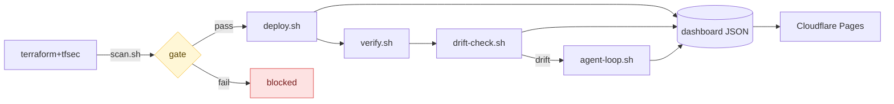

# floci-stack — Shift-Left Cloud Security Sandbox

> Local-only R&D sandbox for shift-left cloud security on Debian WSL + rootless Podman.

<div align="center">

[](https://shift-left-cloud-sandbox.pages.dev)
[](#tool-pins)
[](#data--privacy)
[](#data--privacy)
[](#license)

</div>

## Contents

- [Quick Start](#quick-start)
- [Pipeline diagram](#pipeline-diagram)
- [Repo layout](#repo-layout)
- [Demo walkthrough](#demo-walkthrough)
- [Security controls](#security-controls)
- [Tool pins](#tool-pins)
- [Misconfig demo](#misconfig-demo)
- [Data & Privacy](#data--privacy)
- [Floci limitation](#floci-limitation)
- [License](#license)

## Quick Start

**Prerequisites:** `podman` 5.x · `terraform` 1.5+ · `wrangler` 4.x · `jq` 1.7+ · `podman-compose` 1.6+ · `python3` 3.10+

```bash
podman-compose -f podman-compose.yml up -d   # start floci-core
./scripts/toggle-fixture.sh off              # disable deliberate misconfig
./scripts/scan.sh && ./scripts/deploy.sh     # gate → apply
./scripts/verify.sh && ./scripts/drift-check.sh && ./scripts/agent-loop.sh &
wrangler pages dev dashboard/public --port 8788   # open http://localhost:8788
```

Live: **https://shift-left-cloud-sandbox.pages.dev**

## Pipeline diagram



## Repo layout

| Path | Purpose |
|---|---|
| `terraform/` | VPC + S3 + IAM + SG + flow logs (endpoint-overridable) |
| `scripts/scan.sh` | tfsec gate → dashboard JSON |
| `scripts/toggle-fixture.sh` | Toggle the deliberate misconfig on/off |
| `scripts/deploy.sh` | `terraform apply` against floci (4 hard guards) |
| `scripts/verify.sh` | curl floci directly, confirm resources exist |
| `scripts/drift-check.sh` | `terraform plan -detailed-exitcode` → dashboard JSON |
| `scripts/agent-loop.sh` | Bounded remediation loop (allowlist only) |
| `scripts/sync-dashboard.sh` | Hard-gated publish of dashboard JSON |
| `dashboard/public/` | Static HTML/JS/CSS + 10 JSON data files |
| `wrangler.toml` | Cloudflare Pages config (no KV/D1/Workers) |

## Demo walkthrough

```bash
# State 1 — gate blocks
./scripts/scan.sh             # 2 HIGH (fixture) → gate: FAIL → deploy blocked

# State 2 — passing deploy
./scripts/toggle-fixture.sh off
./scripts/scan.sh             # gate: PASS
./scripts/deploy.sh           # terraform apply → floci
./scripts/verify.sh           # PASS: VPC, bucket, role, SG all exist

# State 3 — drift + agent
./scripts/drift-check.sh      # exit 2 if drift detected
./scripts/agent-loop.sh       # snapshot → terraform apply (if safe + PASS)
```

## Security controls

| Control | Behaviour |
|---|---|
| **tfsec gate** | Blocks `deploy.sh`; freezes agent drift-reconciliation when any HIGH/CRITICAL open |
| **Snapshot-first** | `terraform.tfstate` snapshotted before every `terraform apply` |
| **Credential gate** | `sync-dashboard.sh` refuses push if `AKIA`/`cfut_`/`BEGIN PRIVATE KEY`/non-floci ARNs found |

Agent allows only two actions — `podman restart floci-core` and `terraform apply` (safe drift + PASS gate only). Never edits `*.tf`, never destroys, never touches security-tagged resources.

## Tool pins

> [!CAUTION]
> tfsec **1.28.10 has a regression** — `tfsec:ignore:` directives are silently dropped, making the deliberate misconfig appear clean. Pin to **1.28.5**.

<details>
<summary>Pinned versions + install</summary>

| Tool | Version | Why |
|---|---|---|
| `tfsec` | **1.28.5** | 1.28.10 regression: ignores silently dropped |
| `terraform` | 1.9.8 | Last 1.x BSL release tested |
| `jq` | 1.7.1 | `--rawfile` flag needed by scripts |
| `podman-compose` | 1.6.0 | Rootless Podman compatibility |

```bash
mkdir -p ~/.local/bin
curl -fsSL https://github.com/aquasecurity/tfsec/releases/download/v1.28.5/tfsec-linux-amd64 \
  -o ~/.local/bin/tfsec && chmod +x ~/.local/bin/tfsec
tfsec --version 2>&1 | grep -E "^v1\.28\.5$" || echo "WRONG VERSION"
```

</details>

## Misconfig demo

One deliberate HIGH misconfig (`aws_iam_policy.fixtures_admin`, `Action:"*"` / `Resource:"*"`) is compiled in.

```bash
./scripts/toggle-fixture.sh off   # disable → scan passes → deploy unblocked
./scripts/toggle-fixture.sh on    # re-enable to restore demo state
```

> [!WARNING]
> `agent-loop.sh` cannot fix this — security findings are a human job.

## Data & Privacy

- All IaC targets floci (LocalStack-style endpoint override) — no real AWS calls
- floci-core runs rootless Podman, no host-network
- Dashboard is static JSON via `wrangler pages dev` — no backend, no KV, no D1
- `sync-dashboard.sh` hard-gates on credential patterns before any push

## Floci limitation

floci-core is a Podman stub — not a real workload. It exists only to give `verify.sh` and `drift-check.sh` something to call.

> [!TIP]
> `aws_flow_log.main` may show as `destructive` drift on every run — floci doesn't echo the IAM role ARN back. The agent correctly refuses to act.

## License

Local R&D sandbox. Use at will.

---

<div align="center">
<sub>
<a href="https://github.com/arifbazli/shift-left-cloud-sandbox"><code>shift-left-cloud-sandbox</code></a> ·
<a href="https://shift-left-cloud-sandbox.pages.dev">shift-left-cloud-sandbox.pages.dev</a>
</sub>
</div>
