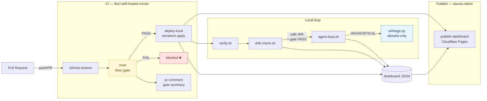

# floci-stack — Shift-Left Cloud Security Sandbox

> Local-only R&D sandbox for shift-left cloud security on Debian WSL + rootless Podman.

<div align="center">

[](https://shift-left-cloud-sandbox.pages.dev)
[](#tool-pins)
[](#data--privacy)
[](#data--privacy)
[](#license)

</div>

## Contents

- [Quick Start](#quick-start)
- [Pipeline diagram](#pipeline-diagram)
- [Repo layout](#repo-layout)
- [Demo walkthrough](#demo-walkthrough)
- [CI pipeline](#ci-pipeline)
- [Security controls](#security-controls)
- [Tool pins](#tool-pins)
- [Misconfig demo](#misconfig-demo)
- [Data & Privacy](#data--privacy)
- [Floci limitation](#floci-limitation)
- [License](#license)

## Quick Start

**Prerequisites:** `podman` 5.x · `terraform` 1.5+ · `tfsec` 1.28.5 · `jq` 1.7+ · `podman-compose` 1.6+ · `python3` 3.10+

```bash
podman-compose -f podman-compose.yml up -d   # start floci-core + 7-module services
./scripts/toggle-fixture.sh off              # disable deliberate misconfig
./scripts/scan.sh && ./scripts/deploy.sh     # gate → apply (all 7 modules)
./scripts/verify.sh && ./scripts/drift-check.sh && ./scripts/agent-loop.sh &
wrangler pages dev dashboard/public --port 8788   # open http://localhost:8788
```

Live: **https://shift-left-cloud-sandbox.pages.dev**

## Pipeline diagram



## Repo layout

| Path | Purpose |
|---|---|
| `terraform/` | Root module — wires all 7 modules |
| `terraform/modules/network/` | VPC, private subnet, SG, flow logs |
| `terraform/modules/storage/` | S3 artifacts + DynamoDB |
| `terraform/modules/security/` | IAM app role, KMS CMK, Secrets Manager, ACM + **fixture** |
| `terraform/modules/compute/` | EC2 (IMDSv2), Lambda, ECS Fargate, EKS (CMK secrets) |
| `terraform/modules/messaging/` | SQS + DLQ, SNS (CMK), EventBridge, Step Functions |
| `terraform/modules/data/` | RDS, ElastiCache Redis, MSK Kafka (CMK), OpenSearch |
| `terraform/modules/api/` | API Gateway REGIONAL, CloudWatch logs + alarm |
| `.github/workflows/pipeline.yml` | Main CI: scan → deploy-local → publish-dashboard → pr-comment |
| `.github/workflows/auto-fix.yml` | Agent-loop remediation triggered by `auto-fix` label |
| `.github/workflows/deploy-dashboard.yml` | Standalone dashboard publish |
| `.github/CODEOWNERS` | Gate scripts + fixture path require `@arifbazli` review |
| `scripts/scan.sh` | tfsec gate → dashboard JSON |
| `scripts/toggle-fixture.sh` | Toggle the deliberate misconfig on/off |
| `scripts/deploy.sh` | `terraform apply` against floci (4 hard guards + 22 endpoint exports) |
| `scripts/verify.sh` | Confirms VPC, bucket, role, SG, DynamoDB, Lambda, SQS, KMS exist |
| `scripts/drift-check.sh` | `terraform plan -detailed-exitcode` → dashboard JSON |
| `scripts/agent-loop.sh` | Bounded remediation loop (allowlist only) |
| `scripts/ai/triage.py` | AI triage — allowlisted MEDIUM/LOW auto-remediation |
| `scripts/setup-runner.sh` | Bootstrap GitHub Actions self-hosted runner on Debian WSL |
| `dashboard/public/` | Static HTML/JS/CSS — findings grouped by module |

## Demo walkthrough

```bash
# State 1 — gate blocks
./scripts/toggle-fixture.sh on
./scripts/scan.sh             # HIGH (AVD-AWS-0057) → gate: FAIL → deploy blocked

# State 2 — passing deploy
./scripts/toggle-fixture.sh off
./scripts/scan.sh             # gate: PASS (152 checks, 0 HIGH/CRITICAL)
./scripts/deploy.sh           # terraform apply → all 7 modules → floci
./scripts/verify.sh           # PASS: VPC, bucket, role, SG, DynamoDB, Lambda, SQS, KMS

# State 3 — drift + agent
./scripts/drift-check.sh      # exit 2 if drift detected
./scripts/agent-loop.sh       # snapshot → terraform apply (safe drift + PASS gate only)

# State 4 — AI triage (dry-run)
./scripts/ai/triage.py \
  --input  dashboard/public/data/tfsec-last.json \
  --tf-dir terraform/ \
  --dry-run
```

## CI pipeline

The GitHub Actions pipeline requires a **self-hosted runner** on the Debian WSL machine (to access LocalStack) and two **repository secrets**:

| Secret | Value |
|---|---|
| `CLOUDFLARE_API_TOKEN` | Pages-scoped API token (generate at dash.cloudflare.com → API Tokens) |
| `CLOUDFLARE_ACCOUNT_ID` | Your Cloudflare account ID |

### Setting up the self-hosted runner

```bash
# Generate a runner registration token at:
# https://github.com/arifbazli/shift-left-cloud-sandbox/settings/actions/runners/new
export GH_RUNNER_TOKEN="<token>"
bash scripts/setup-runner.sh
```

The script installs the runner as a `systemd --user` service labelled `floci-self-hosted` and verifies all tool pre-requisites.

### Adding secrets (safe method — never paste tokens in chat)

```bash
gh secret set CLOUDFLARE_API_TOKEN \
  --repo arifbazli/shift-left-cloud-sandbox
# Paste the value at the interactive prompt (not echoed)

gh secret set CLOUDFLARE_ACCOUNT_ID \
  --repo arifbazli/shift-left-cloud-sandbox
```

### Branch protection

See [`.github/branch-protection.md`](.github/branch-protection.md) for the full ruleset. Minimum requirements for `main`:

- Required status checks: `tfsec gate`, `terraform apply (LocalStack)`
- Require CODEOWNERS review — `modules/security/` and gate scripts need `@arifbazli`
- Block force pushes; `floci-agent-loop` bot not in bypass list

### Import labels

```bash
gh label import .github/labels.yml --repo arifbazli/shift-left-cloud-sandbox
```

## Security controls

| Control | Behaviour |
|---|---|
| **tfsec gate** | Blocks `deploy.sh`; freezes agent drift-reconciliation when any HIGH/CRITICAL open |
| **Snapshot-first** | `terraform.tfstate` snapshotted before every `terraform apply` |
| **Credential gate** | `sync-dashboard.sh` refuses push if `AKIA`/`cfut_`/`BEGIN PRIVATE KEY`/non-floci ARNs found |
| **CODEOWNERS** | `modules/security/`, gate scripts, `.github/` all require human review |
| **AI triage allowlist** | `triage.py` hard-blocks fixture rules, HIGH/CRITICAL, and `modules/security/main.tf` |
| **CMK wiring** | All 7 modules pass `kms_key_arn` from `modules/security` — no AWS-managed key fallback |

Agent (`agent-loop.sh`) allows only: `podman restart floci-core` and `terraform apply` (safe drift + gate PASS). Never edits `*.tf`, never destroys.

`triage.py` allowlist: S3 SSE + versioning + logging, EBS encryption, RDS deletion protection. Everything else is `skipped` or `no-remediation`.

## Tool pins

> [!CAUTION]
> tfsec **1.28.10 has a regression** — `tfsec:ignore:` directives are silently dropped. Pin to **1.28.5**.

<details>
<summary>Pinned versions + install</summary>

| Tool | Version | Why |
|---|---|---|
| `tfsec` | **1.28.5** | 1.28.10 regression: ignores silently dropped |
| `terraform` | 1.9.8 | Last 1.x BSL release tested |
| `jq` | 1.7.1 | `--rawfile` flag needed by scripts |
| `podman-compose` | 1.6.0 | Rootless Podman compatibility |

```bash
mkdir -p ~/.local/bin
curl -fsSL https://github.com/aquasecurity/tfsec/releases/download/v1.28.5/tfsec-linux-amd64 \
  -o ~/.local/bin/tfsec && chmod +x ~/.local/bin/tfsec
tfsec --version 2>&1 | grep "1\.28\.5" || echo "WRONG VERSION"
```

</details>

## Misconfig demo

One deliberate HIGH misconfig (`aws_iam_policy.fixtures_admin`, `Action:"*"` / `Resource:"*"`) lives in `modules/security/main.tf`.

```bash
./scripts/toggle-fixture.sh off   # disable → gate PASS → deploy unblocked
./scripts/toggle-fixture.sh on    # re-enable → gate FAIL → demo state restored
./scripts/toggle-fixture.sh status
```

> [!WARNING]
> `agent-loop.sh` and `triage.py` will never auto-fix this — `AVD-AWS-0057` is hard-blocked.

## Data & Privacy

- All IaC targets floci (LocalStack-style endpoint override) — no real AWS calls
- floci-core runs rootless Podman, no host-network
- Dashboard is static JSON via `wrangler pages dev` — no backend, no KV, no D1
- `sync-dashboard.sh` hard-gates on credential patterns before any push

## Floci limitation

floci-core is a Podman stub — not a real workload. It exists to give `verify.sh` and `drift-check.sh` something to call.

> [!TIP]
> `aws_flow_log.main` may show as `destructive` drift on every run — floci doesn't echo the IAM role ARN back. The agent correctly refuses to act.

## License

Local R&D sandbox. Use at will.

---

<div align="center">
<sub>
<a href="https://github.com/arifbazli/shift-left-cloud-sandbox"><code>shift-left-cloud-sandbox</code></a> ·
<a href="https://shift-left-cloud-sandbox.pages.dev">shift-left-cloud-sandbox.pages.dev</a>
</sub>
</div>
