# floci-stack — Shift-Left Cloud Security Sandbox

> A local, fully offline sandbox that demonstrates **shift-left cloud security**:
> Terraform → tfsec gate → apply against **floci-core** (localstack-style AWS
> API mock) → verify against the real API → drift detection → a tiny bounded
> *"infra engineer"* agent that can react to drift but **never touches `.tf`
> files or fixes security findings.**

<br>

<div align="center">

[](https://shift-left-cloud-sandbox.pages.dev)
[](#pre-flight-tool-pins)
[](#offline-first-design)
[](#live-dashboard)
[](#license)

</div>

<br>

## Developer-terminal dataflow



<br>
<sub>Source: <a href="docs/diagrams/developer-dataflow.mmd">docs/diagrams/developer-dataflow.mmd</a> · rendered with <a href="scripts/render-mermaid.sh">scripts/render-mermaid.sh</a> · theme: <a href="docs/diagrams/mermaid-config.json">mermaid-config.json</a> (fontSize 11px, htmlLabels, max-width friendly)</sub>

<br>

<br>

## Contents

- [TL;DR demo](#tldr-demo)
- [Live dashboard](#live-dashboard)
- [What "deliberate misconfig" means](#what-deliberate-misconfig-means)
- [Why the agent is so restricted](#why-the-agent-is-so-restricted)
- [Pre-flight: tool pins](#pre-flight-tool-pins)
- [Architecture](#architecture)
- [Repo layout](#repo-layout)
- [Offline-first design](#offline-first-design)
- [Backend never exposed — only JSON leaves the machine](#backend-never-exposed--only-json-leaves-the-machine)
- [Known floci limitation (not a bug in this repo)](#known-floci-limitation-not-a-bug-in-this-repo)
- [Why floci specifically](#why-floci-specifically)
- [Demo walkthrough](#demo-walkthrough)
- [Security decisions in code](#security-decisions-in-code)
- [What this is NOT](#what-this-is-not)
- [License](#license)

<br>

## TL;DR demo

```bash
# 1. Bring up floci-core + floci-ui (one command)
podman-compose -f podman-compose.yml up -d

# 2. Run the pipeline (each script tests the one before)
./scripts/scan.sh             # FAILS — the deliberate IAM misconfig is present
./scripts/toggle-fixture.sh off
./scripts/scan.sh             # PASSES
./scripts/deploy.sh           # terraform apply → floci
./scripts/verify.sh           # curl floci directly, confirm bucket / VPC / role exist
./scripts/drift-check.sh      # exit 0 (or 2 if drift)
./scripts/agent-loop.sh &     # bounded remediation loop

# 3. In a separate terminal: the dashboard (local)
wrangler pages dev dashboard/public --port 8788
# open http://localhost:8788
```

<br>

## Live dashboard

> [!IMPORTANT]
> The dashboard is published to **Cloudflare Pages** as a *static-only*
> project. No KV, no D1, no Worker functions. Three JSON files are the
> entire data plane.

| Link | URL |
|---|---|
| **Apex (always latest)** | **https://shift-left-cloud-sandbox.pages.dev** |
| Current production deployment | `c24c7409` → `https://c24c7409.shift-left-cloud-sandbox.pages.dev` |

The dashboard surfaces four signals:

1. **tfsec gate** — `PASS` / `FAIL` with finding counts (critical / high / medium / low / ignored)
2. **Drift** — `CLEAN` / `FROZEN` / `DESTRUCTIVE`, with a classification badge
3. **Agent allowlist** — last action, heartbeat, deny-list reminder
4. **Last synced** — staleness counter (warn past 2 min, critical past 5 min) so the dashboard is honest about latency rather than implying instant live-ness

<details>
<summary><b>Pages auth — one-time manual prerequisite (no script handles this)</b></summary>

On the machine that publishes, run **once**:

```bash
wrangler login
```

That opens a browser, you click "Allow", and wrangler caches an OAuth token
in `~/.config/.wrangler/`. After that, `scripts/deploy-dashboard.sh` and
the chain inside `scripts/sync-dashboard.sh` will publish to Pages without
any further login. The token is **never committed, never logged, never
echoed**.

Alternatively, set `CLOUDFLARE_API_TOKEN=<token>` in your shell env (do
**not** paste the value into chat — each paste is a leak). wrangler will
pick it up automatically.

</details>

<br>

## What "deliberate misconfig" means

`terraform/main.tf` contains **one** resource tagged

```hcl
# >>>>>>>>>>>>>>  DELIBERATE MISCONFIGURATION  <<<<<<<<<<<<<<
```

— an IAM policy with `Action:"*"`, `Resource:"*"`. `scripts/scan.sh` blocks
any `HIGH` or `CRITICAL` finding. To pass the gate, you either:

### Option A — toggle the fixture off (preferred for the demo)

```bash
./scripts/toggle-fixture.sh off   # comments out the fixture
./scripts/scan.sh                 # → 0 HIGH/CRITICAL
./scripts/deploy.sh               # → applies
./scripts/toggle-fixture.sh on    # restore for the next demo
```

### Option B — edit `terraform/main.tf` directly

Remove the two `aws_iam_policy` and `aws_iam_role_policy_attachment` blocks
inside the fixture banner.

> [!WARNING]
> **The agent-loop is explicitly forbidden from doing either.** The
> allowlist is *restart container* + *apply pure drift*. Fixing security
> findings is a human job. See [Why the agent is so restricted](#why-the-agent-is-so-restricted).

<br>

## Why the agent is so restricted

> The spec says *"bounded local infra engineer"* — and the smallest possible
> action surface is the safest.

`scripts/agent-loop.sh` is a deliberately tiny **bash loop**, not an LLM.
It can do exactly **two things**, and nothing else:

| Allowed action | When | Gate |
|---|---|---|
| `podman restart floci-core` | Container exists but is not running | none |
| `terraform apply -auto-approve` | `drift-check.sh` returned exit 2, classification is `safe`, and **latest tfsec gate is `PASS`** | snapshot tfstate first; refuse if any HIGH/CRITICAL open |

**It will never:**

- Edit `*.tf` files
- `terraform destroy` anything
- Run `terraform apply` if the plan changes security-tagged resources
  (VPC SG, IAM, S3 public-access blocks, S3 bucket policies, KMS)
- Disable or bypass the tfsec gate
- Touch `dashboard/public/data/*.json` files other than appending
  well-formed events to `agent-actions.json`

**It also:**

- Freezes on any open `HIGH`/`CRITICAL` tfsec finding (restart still allowed)
- Snapshots `terraform.tfstate` before every allowlisted action, no exceptions
- Logs every action **and** every non-action (with reason) to `dashboard/public/data/agent-actions.json`
- Logs a heartbeat on every loop

This is **by design**. If you want a smarter agent, you have to read the
allowlist and modify it deliberately — and that review IS the change control.

<br>

## Pre-flight: tool pins

> [!CAUTION]
> This sandbox has **one important tool pin** that must be respected or the
> tfsec gate will silently stop working as a gate.

| Tool | Version | Why pinned |
|---|---|---|
| **tfsec** | **1.28.5** | tfsec **1.28.10 has a regression** where `--exclude` / `--config-file` / inline `tfsec:ignore:` are silently ignored. The deliberate misconfig fixture would mark as "clean" and deploy would proceed. Pinned to 1.28.5, which honors ignores correctly. |

Install script (no `sudo` required — installs to `~/.local/bin`):

```bash
mkdir -p ~/.local/bin
curl -fsSL https://github.com/aquasecurity/tfsec/releases/download/v1.28.5/tfsec-linux-amd64 \
  -o ~/.local/bin/tfsec && chmod +x ~/.local/bin/tfsec

# Hash check (optional but recommended):
#   sha256sum ~/.local/bin/tfsec
#   sha256sum docs/tfsec-1.28.5.sha256
```

If you `brew install tfsec` or `npx tfsec` and get a newer version, **the
gate does not work**. Verify with:

```bash
tfsec --version 2>&1 | grep -E "^v1\.28\.5$" || echo "WRONG VERSION"
```

### Also required

| Tool | Min version | Notes |
|---|---|---|
| `podman` | 5.x | rootless; `DOCKER_HOST=podman.socket` if you use the `docker` CLI |
| `terraform` | 1.5+ | `terraform init` will pull `hashicorp/aws ~> 5.0` |
| `wrangler` | 4.x | Cloudflare Pages local dev server **and** Pages deploy |
| `jq` | 1.7+ | JSON wrangling in scripts |
| `podman-compose` | 1.6+ | OR `docker compose` with `DOCKER_HOST=unix:///run/user/$UID/podman/podman.sock` |
| `python3` | 3.10+ | Only used by `scripts/verify.sh` for inline Sigv4 signing; no pip deps |

<br>

## Architecture

### Local sandbox (offline)



<br>
<sub>Source: <a href="docs/diagrams/local-sandbox.mmd">docs/diagrams/local-sandbox.mmd</a></sub>

<br>

### GitHub cloud loop (online)


<br>
<sub>Source: <a href="docs/diagrams/github-loop.mmd">docs/diagrams/github-loop.mmd</a> · Rectangular subgraph is GitHub-side; the dotted <code>merged → redeploy</code> arrow returns to the local sandbox's <code>Floci Podman</code>.</sub>

<br>

## Repo layout

| Path | Purpose |
|---|---|
| `terraform/` | VPC + S3 + IAM + SG + flow logs. Endpoint-overridable. |
| `terraform/main.tf` | The "shape" + one deliberate fixture |
| `terraform/main.tf.with-fixture` | Snapshot used by `toggle-fixture.sh` (committed) |
| `terraform/main.tf.without-fixture` | Snapshot used by `toggle-fixture.sh` (committed) |
| `terraform/providers.tf` | AWS provider with floci endpoint overrides |
| `terraform/variables.tf` | `localstack_enabled = true` (default) |
| `terraform/outputs.tf` | `vpc_id`, bucket name, role ARN, SG ID |
| `scripts/scan.sh` | tfsec gate → dashboard JSON |
| `scripts/toggle-fixture.sh` | comment/uncomment the deliberate misconfig |
| `scripts/bootstrap-fixture-snapshots.sh` | regenerate the two `main.tf.*` files |
| `scripts/deploy.sh` | terraform apply against floci (4 hard guards) |
| `scripts/verify.sh` | curl floci directly, confirm resources exist |
| `scripts/drift-check.sh` | terraform plan `-detailed-exitcode` → dashboard JSON |
| `scripts/agent-loop.sh` | bounded remediation loop (allowlist only) |
| `scripts/deploy-dashboard.sh` | wrangler pages deploy `dashboard/public` |
| `scripts/sync-dashboard.sh` | hard-gated publish of dashboard JSON + redeploy |
| `dashboard/public/index.html` | Dashboard markup — JSON as static assets, no KV/D1 |
| `dashboard/public/app.js` | Client-side fetcher + renderer |
| `dashboard/public/style.css` | Dark-mode-first design system |
| `dashboard/public/data/` | 10 JSON files, written by the scripts above |
| `wrangler.toml` | Cloudflare Pages project config (no KV/D1/Workers) |
| `podman-compose.yml` | floci-core + floci-ui only |
| `README.md` | this file |

<br>

## Offline-first design

- No `apt` deps beyond what's already on Debian
- No Cloudflare account needed for `wrangler pages dev` (purely local)
- All data is local files in `dashboard/public/data/*.json`
- `wrangler pages dev` is **purely local** — it does not talk to Cloudflare
  even if you have a token configured
- The only "external" URLs the sandbox touches are:
  - `http://localhost:4566` (floci-core API)
  - `http://localhost:4569` (floci-ui, if enabled)
  - the wrangler dev server you start on `localhost:8788`
- The only "external" URLs the **published** dashboard touches are the three
  JSON files at `https://shift-left-cloud-sandbox.pages.dev/data/*`

<br>

## Backend never exposed — only JSON leaves the machine

> [!NOTE]
> The deployment surface that ever leaves this box is exactly **ten JSON
> files** under `dashboard/public/data/` — and nothing else.

| File | Written by | Consumed by |
|---|---|---|
| `tfsec-last.json` | `scan.sh` | dashboard, agent-loop (freeze gate) |
| `tfsec-history.json` | `scan.sh` | dashboard |
| `deploy-last.json` | `deploy.sh`, `deploy-dashboard.sh` | dashboard |
| `deploy-history.json` | `deploy.sh`, `deploy-dashboard.sh` | dashboard |
| `verify-pending.json` | `deploy.sh` | `verify.sh` (handoff) |
| `verify-last.json` | `verify.sh` | dashboard |
| `verify-history.json` | `verify.sh` | dashboard |
| `drift-last.json` | `drift-check.sh` | dashboard, agent-loop (classification gate) |
| `drift-history.json` | `drift-check.sh` | dashboard |
| `agent-actions.json` | `agent-loop.sh` | dashboard |

**Nothing else** — no `terraform.tfstate`, no real AWS account ID, no
`floci` binary, no `podman` container, no real credential — ever appears
in any file that gets published.

`scripts/sync-dashboard.sh` enforces this with a **hard gate** that
scans the staged diff for:

- AWS access key prefixes (`AKIA` / `ASIA`)
- Private key markers (`BEGIN ... PRIVATE KEY`)
- Cloudflare token literals (`cfut_…`)
- ARNs with non-floci account IDs (anything other than `000000000000`)

…and refuses to push if **any** of those patterns are present, or if the
staged changes touch anything outside `dashboard/public/data/`.

<br>

## Known floci limitation (not a bug in this repo)

> [!TIP]
> **If `aws_flow_log.main` shows up as `destructive` drift on every
> `drift-check.sh` run, that's correct behavior — it's a floci-core
> limitation, not a bug in this repo.**

floci-core does not echo the attached IAM role ARN back through its
AWS-shaped API. The plan therefore always reports `delete` + `create`
actions for that single resource, which the drift classifier maps to
`destructive`.

This is **correct defensive behavior** on the part of the agent — a real
production agent should refuse to destroy and recreate a resource whose
state it cannot verify was actually broken. It is not a bug in
`scripts/drift-check.sh` or `scripts/agent-loop.sh`.

Operators can confirm the cause:

```bash
cd terraform && terraform show -json .drift.tfplan | \
  jq '.resource_changes[] | select(.address == "aws_flow_log.main")'
```

…and will see `iam_role_arn: ""` in the `before` block.

<br>

## Why floci specifically

`floci-core` is a localstack-style AWS API mock written in Rust. It
supports the subset of AWS API calls that Terraform's AWS provider makes
for VPC, S3, IAM, EC2, and STS. We picked it over `localstack` because:

- Smaller image (~80 MB vs ~1.5 GB)
- 100% offline, no license telemetry
- One binary, no Java/Python runtime
- Same API surface for the Terraform provider, so no special Terraform
  config beyond the `endpoints` block

If you swap to `localstack`, set `TF_VAR_localstack_endpoint` to its port
(default 4566 anyway) and you're done.

<br>

## Demo walkthrough

> Each state assumes you've already run `podman-compose -f podman-compose.yml up -d`.

### State 1 — blocked misconfig

```bash
./scripts/scan.sh
# → tfsec: 2 HIGH (the fixture)
# → gate: FAIL
# → dashboard/public/data/tfsec-last.json shows the failing findings
```

### State 2 — passing deploy

```bash
./scripts/toggle-fixture.sh off
./scripts/scan.sh
# → tfsec: 0 HIGH, 0 CRITICAL
# → gate: PASS
./scripts/deploy.sh
# → terraform apply → floci
# → outputs: vpc_id, bucket name, role ARN
./scripts/verify.sh
# → curl floci for each output
# → PASS: VPC, bucket, role, SG all exist
```

### State 3 — dashboard

```bash
wrangler pages dev dashboard/public --port 8788
# open http://localhost:8788
# → shows 2 events (1 failed scan, 1 passed scan)
# → shows the deploy + verify events
# → live agent heartbeat from agent-loop.sh
# → "last synced: Xs ago" indicator in the top bar
```

### State 4 — drift

```bash
# Manually break a tag in floci (or via a script)
./scripts/drift-check.sh
# → exit 2 (drift detected)
# → logs to dashboard/public/data/drift-history.json
./scripts/agent-loop.sh
# → sees drift + sees latest tfsec is clean
# → snapshots terraform.tfstate
# → runs terraform apply -auto-approve
# → logs "reconciled drift" with before/after state snapshot paths
```

<br>

## Security decisions in code

Every Terraform resource, every script, has a `SEC_INTENT` or `# SEC:`
comment explaining what's tight, what's loose, and why. The comments are
deliberately verbose — this is a sandbox meant to be read by humans
learning shift-left.

### Deliberately loose (with explicit `tfsec:ignore:` and rationale)

- Egress `0.0.0.0/0` on `443` + `53` (sandbox needs internet for tfsec download, etc.)
- AES256 SSE instead of CMK (`tfsec:ignore:` — floci has no KMS)
- IAM `*.s3:GetObject` on `bucket/*` (with `tfsec:ignore:` — bucket-scoped, not account-wide)
- S3 access logging disabled (`MEDIUM` only, not blocking)
- S3 versioning on flow-logs bucket disabled (`MEDIUM` only, not blocking)

### Deliberately UN-ignored (the regression test)

- **IAM `Action:"*"`** on the `fixtures_admin` fixture — that's the
  regression test for the gate. If you remove this and the gate still
  says `PASS`, your tfsec install is broken (see [Pre-flight](#pre-flight-tool-pins)).

<br>

## What this is NOT

- ❌ **Not** a production-grade IaC pipeline. Use Spacelift / Atlantis / Env0 for that.
- ❌ **Not** a real Cloudflare Pages deploy experience. Use `wrangler pages deploy` for that — and we *do*, but only for static assets.
- ❌ **Not** a substitute for Checkov / Trivy / Snyk. tfsec is one of several scanners you should run in a real pipeline.
- ❌ **Not** a "smart" agent. `agent-loop.sh` is a bash loop with a tight allowlist. **That's the point.**

<br>

## License

Local R&D sandbox. Use at will.

---

<div align="center">

<sub>

[`shift-left-cloud-sandbox`](https://github.com/arifbazli/shift-left-cloud-sandbox) ·
[`shift-left-cloud-sandbox.pages.dev`](https://shift-left-cloud-sandbox.pages.dev) ·
[report a bug](https://github.com/arifbazli/shift-left-cloud-sandbox/issues) ·
[request a feature](https://github.com/arifbazli/shift-left-cloud-sandbox/issues)

</sub>

<br>

<sub>Backend: never. Data plane: ten JSON files. Auth: one-time manual.</sub>

</div>
